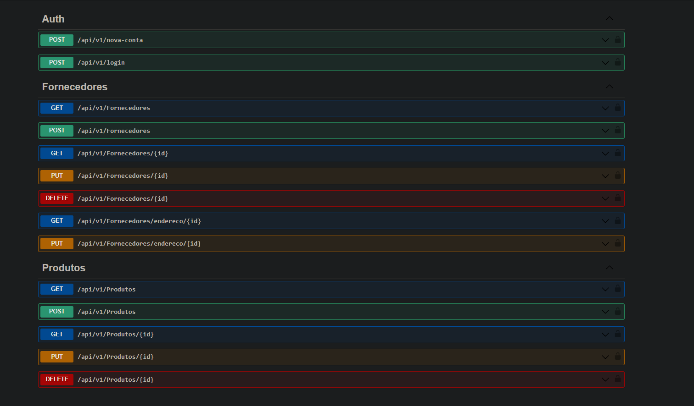

# **Web Api .Net Core 7 Rest**

## *Ferramentas e Tecnologias*
- Visual Studio 2022 ([download](https://visualstudio.microsoft.com/pt-br/downloads/))
- SQL Server Localdb ([download](https://learn.microsoft.com/pt-br/sql/database-engine/configure-windows/sql-server-express-localdb?view=sql-server-ver16))
- Azure Data Studio ([download](https://azure.microsoft.com/pt-br/products/data-studio/))
- .NET 7 ([download](https://dotnet.microsoft.com/en-us/download/dotnet/7.0))

## *Rodar o projeto localmente*

1- Abra o terminal e instale a cli do entity framework
```shell
dotnet tool install --global dotnet-ef
```

2- Clone o repositorio do projeto pra sua maquina e entre na pasta raiz
```shell
git clone https://github.com/Mateus-Castellar/api-aspnet-core.git
cd api-aspnet-core
```

3- Execute as migartions
```shell
dotnet ef database update -s ./src/AppCore.API -c ApiIdentityDbContext
dotnet ef database update -s ./src/AppCore.API -c AppCoreDbContext
```

4- Rode o projeto
```shell
dotnet run --project ./src/AppCore.API
```

5- Acesse a documentação da API (Swagger)
```shell
https://localhost:7196/swagger/index.html
```
## *Prints*



## *Pacotes do projeto*
- FluentValidation
- EntityFrameworkCore
- Swagger
- AutoMapper


